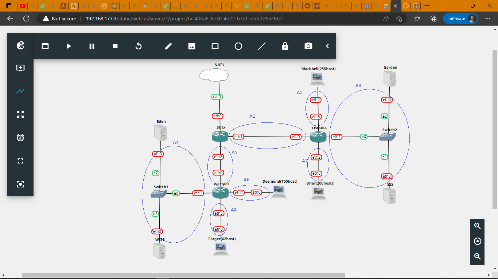
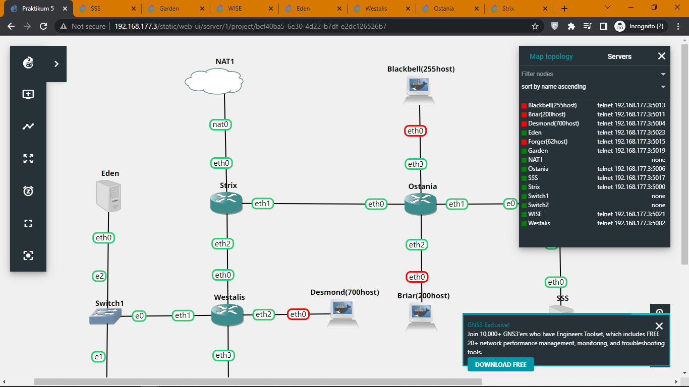

# Lapres Jarkom Kelompok A06

## Anggota Kelompok

1. Hans Sean Nathanael - 5025201019
2. Mohammad Fany Faizul Akbar - 5025201225
3. Fadel Pramaputra Maulana - 502520126

## VLSM

Pembagian IP topologi menggunakan metode VLSM. Berikut adalah pembagian subnet



Kemudian dihitung jumlah host yang dibutuhkan, netmask, dan IP setiap subnet.


IP Subnet didapat dari Tree pembagian IP.

## Konfigurasi Node

1. Strix

```bash
auto eth0
iface eth0 inet dhcp

auto eth1
iface eth1 inet static
	address 10.2.0.1
	netmask 255.255.255.252

auto eth2
iface eth2 inet static
	address 10.2.0.5
	netmask 255.255.255.252
```

2. Ostania

```bash
auto eth0
iface eth0 inet static
	address 10.2.0.2
	netmask 255.255.255.252
	gateway 10.2.0.1

auto eth1
iface eth1 inet static
	address 10.2.0.9
	netmask 255.255.255.248

auto eth2
iface eth2 inet static
	address 10.2.1.1
	netmask 255.255.255.0

auto eth3
iface eth3 inet static
	address 10.2.2.1
	netmask 255.255.254.0
```

3. Westalis

```bash
auto eth0
iface eth0 inet static
	address 10.2.0.6
	netmask 255.255.255.252
	gateway 10.2.0.5

auto eth1
iface eth1 inet static
	address 10.2.0.17
	netmask 255.255.255.248

auto eth2
iface eth2 inet static
	address 10.2.4.1
	netmask 255.255.252.0

auto eth3
iface eth3 inet static
	address 10.2.0.129
	netmask 255.255.255.128
```

4. Eden

```bash
auto eth0
iface eth0 inet static
	address 10.2.0.18
	netmask 255.255.255.248
	gateway 10.2.0.17
```

5. WISE

```bash
auto eth0
iface eth0 inet static
	address 10.2.0.19
	netmask 255.255.255.248
	gateway 10.2.0.17
```

6. Garden

```bash
auto eth0
iface eth0 inet static
	address 10.2.0.10
	netmask 255.255.255.248
	gateway 10.2.0.9
```

7. SSS

```bash
auto eth0
iface eth0 inet static
	address 10.2.0.11
	netmask 255.255.255.248
	gateway 10.2.0.9
```

8. Forger, Desmond, Blackbell, dan Briar

```bash
auto eth0
iface eth0 inet dhcp
```

## Pembagian Tugas

1. Eden adalah DNS Server

Karena Eden harus menjadi DNS Server, maka bind9 diinstall pada Eden.

```bash 
apt-get update
apt-get install bind9 -y
```

2. WISE adalah DHCP Server

Pada WISE diinstall isc-dhcp-server

```bash
apt-get update
apt-get install isc-dhcp-server -y
```

3. Garden dan SSS adalah Web Server

Pada Garden dan SSS diinstall apache2 dan php

```bash 
apt-get update
apt-get install apache2 -y
service apache2 start
apt-get install php -y
```

4. DHCP Relay

Karena pemberian IP subnet Forger, Desmond, Blackbell, dan Briar harus secara dinamis menggunakan DHCP Server yaitu dengan WISE sebagai DHCP Server, maka diperlukan DHCP Relay pada setiap router yang terhubung dengan keempat subnet tersebut, yaitu router Ostania dan Westalis. Pada kedua router tersebut diinstall isc-dhcp-relay

```bash
apt-get update
echo "10.2.0.19" | apt-get install isc-dhcp-relay -y
```
## Nomor 1

### Soal

Agar topologi yang kalian buat dapat mengakses keluar, kalian diminta untuk mengkonfigurasi Strix menggunakan iptables, tetapi Loid tidak ingin menggunakan MASQUERADE.

### Penyelesaian

Agar dapat terhubung dengan internet, dibutuhkan iptables pada Strix, namun karena tidak boleh menggunakan MASQUERADE, digunakan pengganti yaitu

```bash
IP=$(ip a s eth0 | egrep -o 'inet [0-9]{1,3}\.[0-9]{1,3}\.[0-9]{1,3}\.[0-9]{1,3}' | cut -d' ' -f2)

iptables -t nat -A POSTROUTING -o eth0 -j SNAT --to-source $IP -s 10.2.0.0/21
```

Pada command yang atas adalah untuk mengambil IP yang didapat oleh Strix untuk eth0 karena IP yang didapatkan dinamis dari DHCP dan alamat source diubah pada tahap POSTROUTING menjadi IP Strix.

## Nomor 2

### Soal

Kalian diminta untuk melakukan drop semua TCP dan UDP dari luar Topologi kalian pada server yang merupakan DHCP Server demi menjaga keamanan.

### Penyelesaian

Menjalankan script di bawah pada DHCP Server (WISE) yang berfungsi untuk drop TCP dan UDP yang berasal dari luar jaringan 10.2.0.0/21 (jaringan topologi)

```bash
iptables -A INPUT -p udp ! -s 10.2.0.0/21 -j DROP
iptables -A INPUT -p tcp ! -s 10.2.0.0/21 -j DROP
```

## Nomor 3

### Soal

Loid meminta kalian untuk membatasi DHCP dan DNS Server hanya boleh menerima maksimal 2 koneksi ICMP secara bersamaan menggunakan iptables, selebihnya didrop.

### Penyelesaian

Pada DNS(Eden) dan DHCP (WISE) dijalankan script

```bash
iptables -A INPUT -p icmp -m connlimit --connlimit-above 2 --connlimit-mask 0 -j DROP
```

Gunanya untuk membatasi koneksi sehingga untuk koneksi diatas 2 di drop.

## Nomor 4

## Soal

Akses menuju Web Server hanya diperbolehkan disaat jam kerja yaitu Senin sampai Jumat pada pukul 07.00 - 16.00.

## Penyelesaian

Pada Web Server (Garden dan SSS) dijalankan script

```bash
iptables -A INPUT -m time --weekdays Sat,Sun -j REJECT
iptables -A INPUT -m time --timestart 00:00 --timestop 06:59 --weekdays Mon,Tue,Wed,Thu,Fri -j REJECT
iptables -A INPUT -m time --timestart 16:01 --timestop 23:59 --weekdays Mon,Tue,Wed,Thu,Fri -j REJECT
```

## Nomor 5

### Soal

Karena kita memiliki 2 Web Server, Loid ingin Ostania diatur sehingga setiap request dari client yang mengakses Garden dengan port 80 akan didistribusikan secara bergantian pada SSS dan Garden secara berurutan dan request dari client yang mengakses SSS dengan port 443 akan didistribusikan secara bergantian pada Garden dan SSS secara berurutan.

### Penyelesaian

Pengaturan dilakukan pada Ostania karena yang bertugas mengatur laju internet untuk Garden dan SSS (Web Server). Di sini agar dapat membagi digunakan match statistic dan IP tujuannya.

```bash
iptables -t nat -A PREROUTING -p tcp -s 10.2.0.0/21 --dport 80 -d 10.2.0.10 -m state --state NEW -m statistic --mode nth --every 2 --packet 0 -j DNAT --to-destination 10.2.0.10:80
iptables -t nat -A PREROUTING -p tcp -s 10.2.0.0/21 --dport 80 -d 10.2.0.10 -m state --state NEW -m statistic --mode nth --every 1 --packet 0 -j DNAT --to-destination 10.2.0.11:80

iptables -t nat -A PREROUTING -p tcp -s 10.2.0.0/21 --dport 443 -d 10.2.0.11 -m state --state NEW -m statistic --mode nth --every 2 --packet 0 -j DNAT --to-destination 10.2.0.11:80
iptables -t nat -A PREROUTING -p tcp -s 10.2.0.0/21 --dport 443 -d 10.2.0.11 -m state --state NEW -m statistic --mode nth --every 1 --packet 0 -j DNAT --to-destination 10.2.0.10:80
```

## Nomor 6

### Soal

Karena Loid ingin tau paket apa saja yang di-drop, maka di setiap node server dan router ditambahkan logging paket yang di-drop dengan standard syslog level.

### Penyelesaian

Tidak selesai karena terkendala cara mengaturnya, setelah mencoba-coba membuat log berakhir dengan jaringan tidak dapat bekerja.

## Dokumentasi


